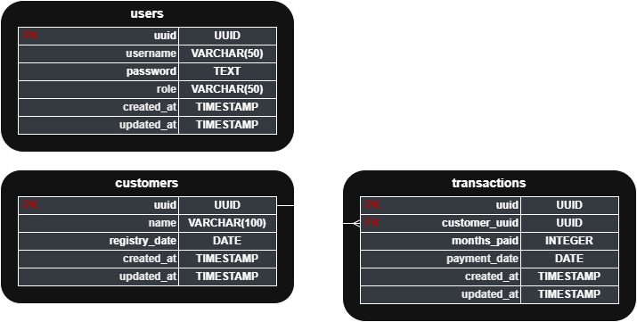

# Monthly Payments - Backend

This backend is designed with RESTful microservices architecture for managing the monthly payments from the members of a group. It is composed by one service that handles the authentication, one that handles members registration, and one that handles the transactions.

| Service               | Responsability                                                  | Exposes API? |
|-----------------------|-----------------------------------------------------------------|--------------|
| `auth-service`        | Users management, authentication, authorization (JWT)           | ✅           |
| `members-service`     | CRUD for group members                                          | ✅           |
| `transactions-service`| Tracks and records monthly payments for group members           | ✅           |

## Entity Relationship Diagram (ERD)

